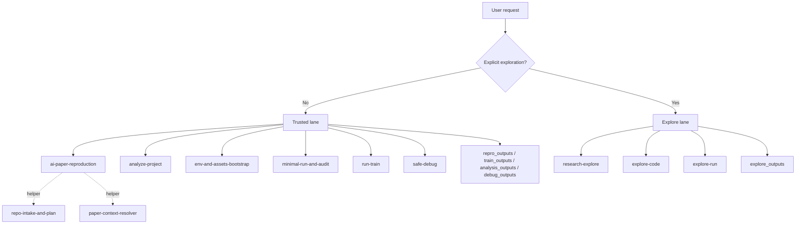
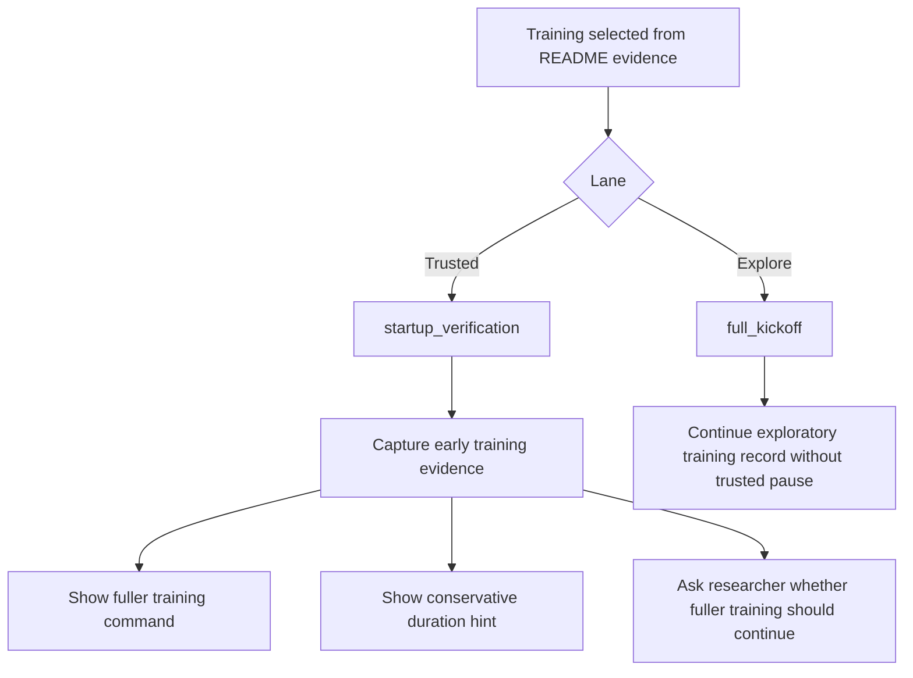

# ai-paper-reproduction-skills

[](./README.md)
[](./README.zh-CN.md)

🚀 Lane-aware skill repository for deep learning research workflows.

This repository is built around one default rule: `trusted by default`. It is meant to provide auditable, reviewable, lane-aware workflows for reproduction, analysis, training, debugging, and explicitly authorized exploration.

The skill directories follow the `SKILL.md` open format, so the same repository can be installed into both Codex and Claude Code. Claude Code can load these skills from `~/.claude/skills/<skill-name>/SKILL.md` or `.claude/skills/<skill-name>/SKILL.md`, and project skills can be invoked directly with `/skill-name`.

🛠️ `ai-paper-reproduction` · 🧭 `env-and-assets-bootstrap` · 🔍 `analyze-project` · ✅ `minimal-run-and-audit` · 🧪 `run-train` · 🩺 `safe-debug` · 🧬 `explore-code` · 📈 `explore-run`

## 🧭 Repository Scope

**What this repository is for**

- README-first AI repository reproduction
- Conservative environment, dataset, checkpoint, and cache planning
- Read-only project and model analysis
- Trusted training startup verification and recorded training execution
- Safe debugging for research repositories
- Explicitly authorized exploratory code and run work
- End-to-end exploratory orchestration on top of `current_research`

**What this repository is not for**

- General paper summarization
- Unbounded autonomous research agents
- Default large-scale AI-driven code rewriting

## 🔒 Core Policy

- trusted by default
- README-first for reproduction
- explicit exploration only
- low-risk changes before code edits
- audit-heavy trusted outputs
- summary-heavy exploratory outputs

Shared routing, branch, output, and pitfall policies live under [references/](references/).

## 🗺️ High-Level Lane Diagram



## 📦 Install

Install the full repository skill set in Codex:

```bash
npx skills add lllllllama/ai-paper-reproduction-skills --all
```

Install only the main orchestrator in Codex:

```bash
npx skills add lllllllama/ai-paper-reproduction-skills --skill ai-paper-reproduction
```

Install from a local clone into Codex:

```bash
python scripts/install_skills.py --client codex --target ~/.codex/skills --force
```

Install from a local clone into Claude Code:

```bash
python scripts/install_skills.py --client claude --target ~/.claude/skills --force
```

Install into a project-scoped Claude Code skills directory:

```bash
python scripts/install_skills.py --client claude --target ./.claude/skills --force
```

Claude Code can auto-invoke these skills when the descriptions match, or you can call them explicitly with commands such as `/ai-paper-reproduction` and `/safe-debug`.

## 🧩 Public Skill Matrix

| Lane | Skill | Purpose |
|---|---|---|
| Trusted | 🛠️ `ai-paper-reproduction` | End-to-end README-first reproduction orchestrator |
| Trusted | 🧭 `env-and-assets-bootstrap` | Conservative environment, dataset, checkpoint, and cache planning |
| Trusted | ✅ `minimal-run-and-audit` | Trusted inference, evaluation, smoke, and sanity execution |
| Trusted | 🔍 `analyze-project` | Read-only project analysis, model mapping, and risk surfacing |
| Trusted | 🧪 `run-train` | Training startup verification, resume handling, bounded monitoring, and training records |
| Trusted | 🩺 `safe-debug` | Research-safe debugging: analyze first, patch only after approval |
| Explore | `research-explore` | End-to-end exploratory orchestration on top of `current_research` |
| Explore | 🧬 `explore-code` | Exploratory code adaptation, transplant, and stitching on isolated branches |
| Explore | 📈 `explore-run` | Small-subset probes, short-cycle trials, and ranked exploratory runs |
| Helper | 🗂️ `repo-intake-and-plan` | Narrow helper for repo scanning and README command extraction |
| Helper | 📄 `paper-context-resolver` | Narrow helper for README-paper gap resolution |

## 🔄 Current Trusted Reproduction Flow

The main orchestrator currently implements the following flow:

1. Scan the repository structure and README.
2. Extract documented commands.
3. Choose the smallest trustworthy target with the priority:
   - documented inference
   - documented evaluation
   - documented training
4. Generate a conservative environment setup plan.
5. Generate a conservative asset manifest for datasets, checkpoints, weights, and cache.
6. Execute the selected target:
   - non-training targets go through the trusted verify path
   - training targets go through `run-train`
7. Write `repro_outputs/`
8. If training was selected, also write `train_outputs/`

## 🧪 Trusted Training Decision Flow



## 🛡️ Trusted Training Behavior

Training is intentionally conservative in trusted reproduction.

- If the README exposes a smaller documented inference or evaluation target, the orchestrator prefers that first.
- If training is the current smallest trustworthy target, the orchestrator first performs startup verification or a short monitored training check.
- This is not treated as full training by default.
- After the short verification, it surfaces:
  - the fuller training command it would continue with
  - a conservative duration hint
  - an explicit human review checkpoint

## 🔬 Explore Training Behavior

Exploration must be explicit.

- `research-explore`, `explore-code`, and `explore-run` are never the default route.
- `research-explore` is the end-to-end explore orchestrator when the task spans both `current_research` coordination and exploratory code-plus-run work.
- In the explore lane, training does not stop at the trusted-lane confirmation checkpoint.
- Exploratory results are candidates only and must not be presented as trusted reproduction success.

## 📁 Output Directories

| Directory | Purpose |
|---|---|
| `repro_outputs/` | Trusted reproduction bundle |
| `train_outputs/` | Trusted training execution bundle |
| `analysis_outputs/` | Read-only project analysis |
| `debug_outputs/` | Safe debug diagnosis and patch plan |
| `explore_outputs/` | Exploratory changeset and ranked run summary |

## 💬 Example Prompts

**Trusted reproduction**

```text
Use ai-paper-reproduction on this AI repo. Stay README-first, prefer documented inference or evaluation, avoid unnecessary repo changes, and write outputs to repro_outputs/.
```

**Read-only analysis**

```text
Use analyze-project on this repo. Read the code, map the model and training entrypoints, and flag suspicious patterns without editing files.
```

**Trusted training**

```text
Use run-train on this repo. Run the selected documented training command conservatively for startup verification and write train_outputs/.
```

**Safe debug**

```text
Use safe-debug on this traceback. Diagnose the failure first, propose the smallest safe fix, and do not patch until I approve.
```

**Explicit exploration**

```text
Use research-explore on top of current_research improved-model@branch. Work on an isolated branch, coordinate code and run exploration together, try several variants, and rank candidates in explore_outputs/.
```

```text
Use explore-code on an isolated branch. Try a LoRA adaptation for this backbone, keep it exploratory only, and summarize the changes in explore_outputs/.
```

```text
Use explore-run on an experiment branch. Do a small-subset short-cycle sweep, rank the top runs, and treat the results as candidates only.
```

## ✅ Local Validation

Run the full validation set:

```bash
python scripts/validate_repo.py
python scripts/test_bootstrap_env.py
python scripts/test_install_targets.py
python scripts/test_skill_registry.py
python scripts/test_trigger_boundaries.py
python scripts/test_readme_selection.py
python scripts/test_output_rendering.py
python scripts/test_train_output_rendering.py
python scripts/test_analysis_output_rendering.py
python scripts/test_safe_debug_output_rendering.py
python scripts/test_explore_output_rendering.py
python scripts/test_explore_variant_matrix.py
python scripts/test_research_explore_dry_run.py
python scripts/test_setup_planning.py
python scripts/test_orchestrator_dry_run.py
python scripts/test_training_lane_routing.py
```

If installation behavior changed, also run:

```bash
python scripts/install_skills.py --client codex --target ./tmp/codex-skills --force
python scripts/install_skills.py --client claude --target ./tmp/claude-skills --force
```

GitHub Actions validates this repository on `ubuntu-latest`, `macos-latest`, and `windows-latest`.

## 🧠 Routing Summary

- ambiguous requests go to the trusted lane
- exploration requires explicit authorization
- trusted skills must not auto-route into exploration
- explore skills must not claim trusted reproduction success
- same-level skills should not call each other directly

## 📚 Registry and Shared Policy References

- Skill registry: [references/skill-registry.json](references/skill-registry.json)
- Routing policy: [references/routing-policy.md](references/routing-policy.md)
- Branch and commit policy: [references/branch-and-commit-policy.md](references/branch-and-commit-policy.md)
- Output contract: [references/output-contract.md](references/output-contract.md)
- Research pitfall checklist: [references/research-pitfall-checklist.md](references/research-pitfall-checklist.md)

## ⚠️ Current Limits

- `run-train` is currently a bounded training monitor, not a full long-running scheduler.
- Trusted reproduction still avoids silent semantic changes.
- Helper skills remain narrow and are not intended to become public “do everything” entrypoints.
- Exploratory work must stay isolated from trusted baselines.

## 🎯 Final Scope

This is a lane-aware deep learning research skill repository optimized for safety, observability, and reuse.
