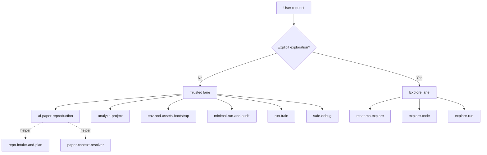

# 🚀 ai-paper-reproduction-skills

<p>
  <a href="./README.md">🇺🇸 English</a> ·
  <a href="./README.zh-CN.md">🇨🇳 简体中文</a>
</p>

<p>
  
  
  
  
</p>

Lane-aware skill repository for deep learning research workflows.

> 🧭 Trusted for reproduction, setup, analysis, training verification, and debugging.  
> 🔬 Explore only when the researcher explicitly authorizes candidate-only work.  
> 🤝 Share the same `SKILL.md` skills across Agent Skills, Codex, and Claude Code.

This repository is built around one default rule: `trusted by default`.

- Ambiguous requests route to the trusted lane.
- Exploration requires explicit authorization.
- Trusted outputs are auditable and durable.
- Explore outputs are candidate-only and disposable.

The skills use the open `SKILL.md` layout, so the same repository can be installed into neutral Agent Skills directories as well as Codex and Claude Code. For shared local installs, prefer `~/.agents/skills/` or `./.agents/skills/`. Client-specific installs under `~/.codex/skills/` and `~/.claude/skills/` remain supported.

🛠️ `ai-paper-reproduction` · 🔬 `research-explore` · 🧭 `env-and-assets-bootstrap` · 🔍 `analyze-project` · ✅ `minimal-run-and-audit` · 🧪 `run-train` · 🩺 `safe-debug` · 🧬 `explore-code` · 📈 `explore-run`

## ✨ What This Repo Covers

**In scope**

- README-first AI repository reproduction
- Conservative environment, dataset, checkpoint, and cache planning
- Read-only repository and model analysis
- Trusted training startup verification and bounded training monitoring
- Safe debugging for research repositories
- Explicitly authorized exploratory code and run work
- End-to-end exploratory orchestration on top of `current_research`

**Out of scope**

- General paper summarization
- Unbounded autonomous research agents
- Default large-scale code rewriting
- Implicit experimentation on top of a trusted baseline

## 🧭 Choose an Entry Point

| If you want to... | Use |
|---|---|
| Reproduce a repository end-to-end from the README | `ai-paper-reproduction` |
| Explore code-and-run variants end-to-end on top of `current_research` | `research-explore` |
| Analyze the repository without editing or running heavy jobs | `analyze-project` |
| Prepare environment, dataset, checkpoint, and cache assumptions | `env-and-assets-bootstrap` |
| Run a documented inference or evaluation command conservatively | `minimal-run-and-audit` |
| Start or resume documented training conservatively | `run-train` |
| Diagnose a traceback or failed training/inference run safely | `safe-debug` |
| Make isolated exploratory code changes only | `explore-code` |
| Run isolated exploratory trials only | `explore-run` |

Bundled helper skills:

- `repo-intake-and-plan`
- `paper-context-resolver`

## 🔀 Lanes

### 🛡️ Trusted lane

Use the trusted lane for reproduction, setup, analysis, bounded execution, training verification, and debugging.

- Primary end-to-end orchestrator: `ai-paper-reproduction`
- Output directories: `repro_outputs/`, `train_outputs/`, `analysis_outputs/`, `debug_outputs/`
- Default stance: preserve scientific meaning, minimize semantic changes, surface assumptions and blockers

### 🔬 Explore lane

Use the explore lane only when the researcher explicitly authorizes candidate-only exploratory work.

- Primary end-to-end orchestrator: `research-explore`
- Narrow leaf skills: `explore-code`, `explore-run`
- Output directory: `explore_outputs/`
- Key anchor: `current_research`

`current_research` should be a durable reference such as a branch, commit, checkpoint, run record, or already-trained local model state. It does not imply a trusted baseline; it is the context the exploration branches from.

### 🧰 Helper lane

Helpers are narrow and should usually be orchestrator-invoked rather than used as the first entry point.

## 🤝 Client Compatibility

`SKILL.md` is the canonical cross-client contract in this repository.

- Required for portability: `SKILL.md`, repository-local `scripts/`, and `references/`
- Optional Codex UI metadata: `agents/openai.yaml`
- Optional Claude Code project entrypoints: `.claude/commands/*.md`
- Not allowed: making skill behavior depend on a client-specific metadata file

See [references/client-compatibility-policy.md](references/client-compatibility-policy.md).



## 📦 Install

Install from a local clone into a neutral Agent Skills directory:

```bash
python scripts/install_skills.py --client agents --target ~/.agents/skills --force
```

Install into a project-scoped neutral Agent Skills directory:

```bash
python scripts/install_skills.py --client agents --target ./.agents/skills --force
```

Install with the default neutral target:

```bash
python scripts/install_skills.py --force
```

Install the full repository skill set in Codex:

```bash
npx skills add lllllllama/ai-paper-reproduction-skills --all
```

Install only the trusted reproduction orchestrator in Codex:

```bash
npx skills add lllllllama/ai-paper-reproduction-skills --skill ai-paper-reproduction
```

Install from a local clone into Codex:

```bash
python scripts/install_skills.py --client codex --target ~/.codex/skills --force
```

Install from a local clone into Claude Code:

```bash
python scripts/install_skills.py --client claude --target ~/.claude/skills --force
```

Install into a project-scoped Claude Code skills directory:

```bash
python scripts/install_skills.py --client claude --target ./.claude/skills --force
```

Claude Code can auto-invoke these skills when the descriptions match, or you can call them directly with commands such as `/ai-paper-reproduction`, `/research-explore`, and `/safe-debug`.

This repository also ships project-scoped Claude Code slash commands under `.claude/commands/` for the main entrypoints:

- `/ai-paper-reproduction`
- `/research-explore`
- `/analyze-project`
- `/safe-debug`

## 🧩 Public Skill Matrix

| Lane | Skill | Purpose |
|---|---|---|
| Trusted | `ai-paper-reproduction` | End-to-end README-first reproduction orchestrator |
| Trusted | `env-and-assets-bootstrap` | Conservative environment, dataset, checkpoint, and cache planning |
| Trusted | `minimal-run-and-audit` | Trusted inference, evaluation, smoke, and sanity execution |
| Trusted | `analyze-project` | Read-only project analysis, model mapping, and risk surfacing |
| Trusted | `run-train` | Training startup verification, resume handling, bounded monitoring, and training records |
| Trusted | `safe-debug` | Research-safe debugging: analyze first, patch only after approval |
| Explore | `research-explore` | End-to-end exploratory orchestration on top of `current_research` |
| Explore | `explore-code` | Exploratory code adaptation, transplant, and stitching on isolated branches |
| Explore | `explore-run` | Small-subset probes, short-cycle trials, and ranked exploratory runs |
| Helper | `repo-intake-and-plan` | Narrow helper for repo scanning and README command extraction |
| Helper | `paper-context-resolver` | Narrow helper for README-paper gap resolution |

## 🔄 Core Flows

### 🛠️ Trusted reproduction flow

`ai-paper-reproduction` follows this high-level sequence:

1. Scan the repository structure and README.
2. Extract documented commands.
3. Choose the smallest trustworthy target in this order:
   - documented inference
   - documented evaluation
   - documented training
4. Generate a conservative environment and asset plan.
5. Execute through `minimal-run-and-audit` or `run-train`.
6. Write `repro_outputs/`.
7. If training was selected, also write `train_outputs/`.

### 🧪 Trusted training semantics

Training is intentionally conservative in the trusted lane.

- If the README exposes a smaller documented inference or evaluation target, the orchestrator prefers that first.
- If training is the current smallest trustworthy target, `run-train` starts with startup verification or a short monitored training check.
- The trusted lane does not silently convert this into an open-ended long run.
- The output should surface the fuller training command, a conservative duration hint, and the next safe action for the researcher.

### 🔬 Exploratory research flow

`research-explore` is the end-to-end explore orchestrator when the task spans both exploratory code work and exploratory runs.

1. Confirm `current_research`.
2. Create or reserve an isolated experiment branch or worktree.
3. Use `analyze-project` or `env-and-assets-bootstrap` only when the current repository context is still unclear.
4. Coordinate `explore-code` and `explore-run` as needed.
5. Keep all results candidate-only.
6. Write `explore_outputs/`.

The explore lane must not claim trusted reproduction success.

## 📁 Output Directories

| Directory | Purpose |
|---|---|
| `repro_outputs/` | Trusted reproduction bundle |
| `train_outputs/` | Trusted training execution bundle |
| `analysis_outputs/` | Read-only project analysis |
| `debug_outputs/` | Safe debug diagnosis and patch plan |
| `explore_outputs/` | Exploratory changeset and ranked run summary |

## 💬 Example Prompts

**Trusted reproduction**

```text
Use ai-paper-reproduction on this AI repo. Stay README-first, prefer documented inference or evaluation, avoid unnecessary repo changes, and write outputs to repro_outputs/.
```

**Current-research exploration**

```text
Use research-explore on top of current_research improved-model@branch. Work on an isolated branch, coordinate code and run exploration together, try several variants, and rank candidates in explore_outputs/.
```

**Read-only analysis**

```text
Use analyze-project on this repo. Read the code, map the model and training entrypoints, and flag suspicious patterns without editing files.
```

**Trusted training**

```text
Use run-train on this repo. Run the selected documented training command conservatively for startup verification and write train_outputs/.
```

**Safe debug**

```text
Use safe-debug on this traceback. Diagnose the failure first, propose the smallest safe fix, and do not patch until I approve.
```

**Exploratory code only**

```text
Use explore-code on an isolated branch. Try a LoRA adaptation for this backbone, keep it exploratory only, and summarize the changes in explore_outputs/.
```

**Exploratory runs only**

```text
Use explore-run on an experiment branch. Do a small-subset short-cycle sweep, rank the top runs, and treat the results as candidates only.
```

## ✅ Local Validation

Run the repository checks:

```bash
python scripts/validate_repo.py
python scripts/test_skill_registry.py
python scripts/test_trigger_boundaries.py
python scripts/test_claude_command_wrappers.py
python scripts/test_readme_selection.py
```

Run output and orchestration regressions:

```bash
python scripts/test_output_rendering.py
python scripts/test_train_output_rendering.py
python scripts/test_analysis_output_rendering.py
python scripts/test_safe_debug_output_rendering.py
python scripts/test_explore_output_rendering.py
python scripts/test_explore_variant_matrix.py
python scripts/test_research_explore_dry_run.py
python scripts/test_orchestrator_dry_run.py
python scripts/test_training_lane_routing.py
```

Run setup and installer regressions:

```bash
python scripts/test_bootstrap_env.py
python scripts/test_install_targets.py
python scripts/test_setup_planning.py
python scripts/install_skills.py --client agents --target ./tmp/agents-skills --force
python scripts/install_skills.py --client codex --target ./tmp/codex-skills --force
python scripts/install_skills.py --client claude --target ./tmp/claude-skills --force
```

GitHub Actions validates this repository on `ubuntu-latest`, `macos-latest`, and `windows-latest`.

## 📐 Routing Summary

- Ambiguous requests go to the trusted lane.
- Exploration requires explicit authorization.
- Trusted skills must not auto-route into exploration.
- Explore outputs must not claim trusted reproduction success.
- Peer leaf skills should not call each other directly.
- End-to-end orchestration should happen through the public orchestrator for the relevant task family.

## 📚 References

- Skill registry: [references/skill-registry.json](references/skill-registry.json)
- Client compatibility policy: [references/client-compatibility-policy.md](references/client-compatibility-policy.md)
- Routing policy: [references/routing-policy.md](references/routing-policy.md)
- Trigger boundary policy: [references/trigger-boundary-policy.md](references/trigger-boundary-policy.md)
- Branch and commit policy: [references/branch-and-commit-policy.md](references/branch-and-commit-policy.md)
- Output contract: [references/output-contract.md](references/output-contract.md)
- Research pitfall checklist: [references/research-pitfall-checklist.md](references/research-pitfall-checklist.md)

## ⚠️ Current Limits

- `run-train` is a bounded training monitor, not a full long-running scheduler.
- Trusted reproduction still avoids silent semantic changes.
- Helper skills remain narrow and are not intended to become public catch-all entry points.
- Exploratory work must stay isolated from trusted baselines.

## 🎯 Scope

This is a lane-aware deep learning research skill repository optimized for safety, observability, and reuse.
