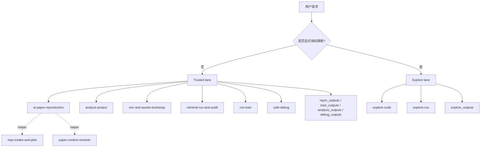
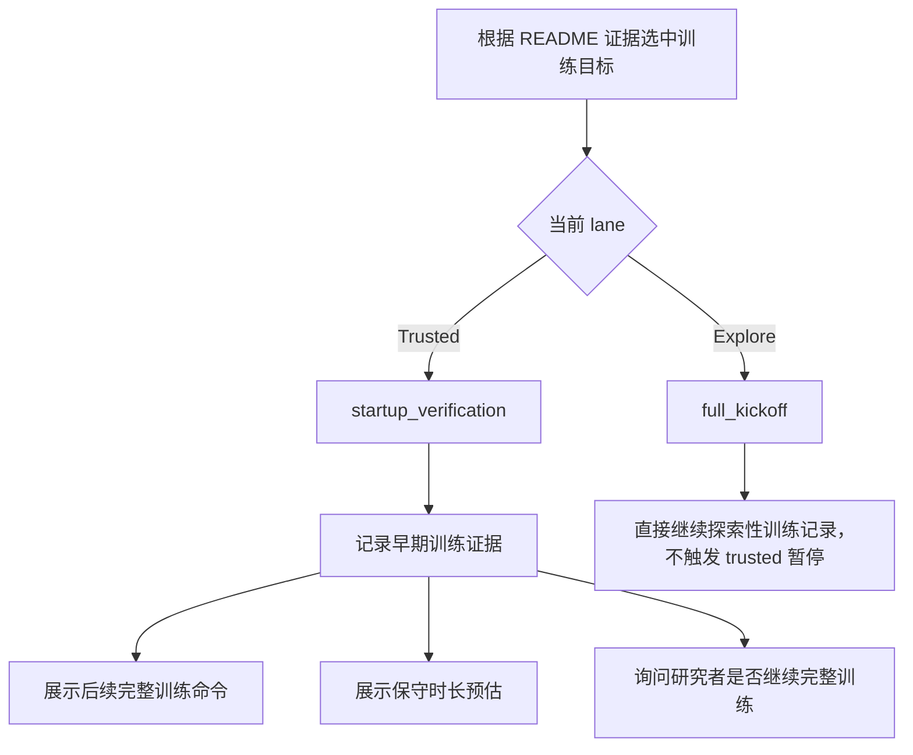

# ai-paper-reproduction-skills

[](./README.md)
[](./README.zh-CN.md)

🚀 面向深度学习研究工作流的 lane-aware skills 仓库。

这个仓库围绕一个默认规则构建：`trusted by default`。它的目标不是让 AI 无约束地改写科研代码，而是为复现、分析、训练、调试和显式授权的探索提供可审计、可回看、可分流的工作流。

🛠️ `ai-paper-reproduction` · 🧭 `env-and-assets-bootstrap` · 🔍 `analyze-project` · ✅ `minimal-run-and-audit` · 🧪 `run-train` · 🩺 `safe-debug` · 🧬 `explore-code` · 📈 `explore-run`

## 🧭 仓库定位

**这个仓库适合什么**

- README-first 的 AI 仓库复现
- 保守的环境、数据集、checkpoint 与 cache 规划
- 只读的项目与模型分析
- 可信的训练启动验证与训练记录
- 科研仓库中的安全调试
- 明确授权后的探索性代码与实验尝试

**这个仓库不适合什么**

- 通用论文总结
- 无边界的自主科研 agent
- 默认大规模 AI 驱动的代码重写

## 🔒 核心原则

- trusted by default
- README-first for reproduction
- explicit exploration only
- low-risk changes before code edits
- audit-heavy trusted outputs
- summary-heavy exploratory outputs

共享路由、分支、输出和坑点规则都放在 [references/](references/) 下。

## 🗺️ 总体 lane 结构图



## 📦 安装

安装完整 skill 集合：

```bash
npx skills add lllllllama/ai-paper-reproduction-skills --all
```

只安装主 orchestrator：

```bash
npx skills add lllllllama/ai-paper-reproduction-skills --skill ai-paper-reproduction
```

Local clone, Codex:

```bash
python scripts/install_skills.py --client codex --target ~/.codex/skills --force
```

Local clone, Claude Code:

```bash
python scripts/install_skills.py --client claude --target ~/.claude/skills --force
```

Project-scoped Claude Code install:

```bash
python scripts/install_skills.py --client claude --target ./.claude/skills --force
```

## 🧩 当前公开 skill 矩阵

| Lane | Skill | 作用 |
|---|---|---|
| Trusted | 🛠️ `ai-paper-reproduction` | README-first 的端到端复现主编排 |
| Trusted | 🧭 `env-and-assets-bootstrap` | 环境、数据集、checkpoint 与 cache 的保守规划 |
| Trusted | ✅ `minimal-run-and-audit` | 推理、评测、smoke 与 sanity 的可信执行 |
| Trusted | 🔍 `analyze-project` | 只读项目分析、模型结构梳理与风险提示 |
| Trusted | 🧪 `run-train` | 训练启动验证、恢复、有限监控与训练记录 |
| Trusted | 🩺 `safe-debug` | 先分析、后建议、获批后再修的科研安全调试 |
| Explore | 🧬 `explore-code` | 隔离分支上的探索性代码迁移、适配与缝合 |
| Explore | 📈 `explore-run` | 小子集试探、短周期实验与候选结果排序 |
| Helper | 🗂️ `repo-intake-and-plan` | README 命令提取与仓库扫描的窄辅助 skill |
| Helper | 📄 `paper-context-resolver` | README 与论文之间窄缺口补全的辅助 skill |

## 🔄 当前可信复现流程

当前主 orchestrator 已经实现如下流程：

1. 扫描仓库结构与 README。
2. 提取已文档化命令。
3. 选择最小可信目标，优先级为：
   - 已文档化推理
   - 已文档化评测
   - 已文档化训练
4. 生成保守的环境安装计划。
5. 生成数据集、checkpoint、weights 与 cache 的保守资源清单。
6. 执行选中的目标：
   - 非训练目标走 trusted verify 路径
   - 训练目标走 `run-train`
7. 写出 `repro_outputs/`
8. 如果选中了训练目标，额外写出 `train_outputs/`

## 🧪 Trusted 训练决策图



## 🛡️ Trusted 训练行为

在 trusted 复现场景中，训练默认是保守的。

- 如果 README 中存在更小的推理或评测目标，orchestrator 会优先走这些目标。
- 如果训练是当前最小可信目标，则会先执行 startup verification 或短时监控训练。
- 这一步不会默认被视为完整训练复现。
- 在短时验证后，系统会展示：
  - 后续完整训练将执行的命令
  - 一个保守的训练时长提示
  - 一个明确的人类确认点

## 🔬 Explore 训练行为

探索必须显式授权。

- `explore-code` 和 `explore-run` 从来不是默认路由。
- 在 explore lane 中，训练不会停在 trusted lane 的“先确认再继续”检查点。
- 探索结果只能作为候选线索，不能自动宣称为可信复现成功。

## 📁 输出目录

| Directory | 作用 |
|---|---|
| `repro_outputs/` | 可信复现主输出 |
| `train_outputs/` | 可信训练执行输出 |
| `analysis_outputs/` | 只读项目分析输出 |
| `debug_outputs/` | 安全调试诊断与修复计划 |
| `explore_outputs/` | 探索性改动和候选结果摘要 |

## 💬 示例提示词

**可信复现**

```text
请使用 ai-paper-reproduction 处理这个 AI 仓库。保持 README-first，优先尝试文档中的推理或评测，不要做不必要的代码修改，并将结果写入 repro_outputs/。
```

**只读分析**

```text
请使用 analyze-project 分析这个仓库。阅读代码，梳理模型结构和训练入口，标出可疑实现，但不要修改文件。
```

**可信训练**

```text
请使用 run-train 在这个仓库上执行文档中的训练命令，先做保守的启动验证，并将记录写入 train_outputs/。
```

**安全调试**

```text
请使用 safe-debug 分析这段报错。先诊断原因，再给出最小安全修复建议，未获得我确认前不要直接修改代码。
```

**显式探索**

```text
请使用 explore-code 在隔离分支上尝试一个 LoRA 适配，只把它视为探索任务，并把改动摘要写入 explore_outputs/。
```

```text
请使用 explore-run 在实验分支上做一个小子集短周期 sweep，对候选结果排序，并把结果仅作为探索候选写入 explore_outputs/。
```

## ✅ 本地验证

运行完整验证集：

```bash
python scripts/validate_repo.py
python scripts/test_bootstrap_env.py
python scripts/test_install_targets.py
python scripts/test_skill_registry.py
python scripts/test_trigger_boundaries.py
python scripts/test_readme_selection.py
python scripts/test_output_rendering.py
python scripts/test_train_output_rendering.py
python scripts/test_analysis_output_rendering.py
python scripts/test_safe_debug_output_rendering.py
python scripts/test_explore_output_rendering.py
python scripts/test_explore_variant_matrix.py
python scripts/test_setup_planning.py
python scripts/test_orchestrator_dry_run.py
python scripts/test_training_lane_routing.py
```

如果安装行为变更，还应额外运行：

```bash
python scripts/install_skills.py --client codex --target ./tmp/codex-skills --force
python scripts/install_skills.py --client claude --target ./tmp/claude-skills --force
```

## 🧠 路由摘要

- 模糊请求默认进入 trusted lane
- 探索必须显式授权
- trusted skill 不得自动掉入 exploration
- explore skill 不得宣称 trusted reproduction success
- 同级 skill 不应直接互调

## 📚 注册表与共享策略

- Skill registry: [references/skill-registry.json](references/skill-registry.json)
- Routing policy: [references/routing-policy.md](references/routing-policy.md)
- Branch and commit policy: [references/branch-and-commit-policy.md](references/branch-and-commit-policy.md)
- Output contract: [references/output-contract.md](references/output-contract.md)
- Research pitfall checklist: [references/research-pitfall-checklist.md](references/research-pitfall-checklist.md)

## ⚠️ 当前边界

- `run-train` 目前是有界训练监控器，不是完整的长期训练调度器。
- trusted reproduction 仍然严格避免静默修改实验语义。
- helper skill 保持狭窄边界，不是公开的“万能入口”。
- exploratory work 必须与 trusted baseline 隔离。

## 🎯 最终范围

这是一个强调安全性、可观测性和复用性的深度学习科研 skills 仓库。
