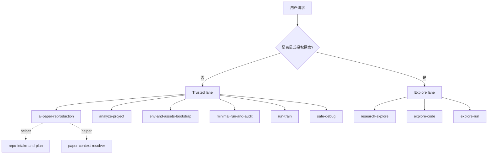

# 🚀 ai-paper-reproduction-skills

<p>
  <a href="./README.md">🇺🇸 English</a> ·
  <a href="./README.zh-CN.md">🇨🇳 简体中文</a>
</p>

<p>
  
  
  
  
</p>

面向深度学习科研工作流的 lane-aware skill 仓库。

> 🧭 `trusted` 负责复现、环境准备、分析、训练验证和安全调试。  
> 🔬 `explore` 只在研究者显式授权后处理候选性探索工作。  
> 🤝 同一套 `SKILL.md` 可以在 Agent Skills、Codex 和 Claude Code 中复用。

这个仓库围绕一个默认原则构建：`trusted by default`。

- 模糊请求默认进入 trusted lane
- 探索必须显式授权
- trusted 输出强调可审计和可复看
- explore 输出强调候选性和可丢弃性

本仓库采用开放的 `SKILL.md` 结构，因此既可以安装到中立的 Agent Skills 目录，也可以安装到 Codex 和 Claude Code。共享本地安装优先推荐 `~/.agents/skills/` 或 `./.agents/skills/`；客户端专属目录 `~/.codex/skills/` 和 `~/.claude/skills/` 也继续支持。

🛠️ `ai-paper-reproduction` · 🔬 `research-explore` · 🧭 `env-and-assets-bootstrap` · 🔍 `analyze-project` · ✅ `minimal-run-and-audit` · 🧪 `run-train` · 🩺 `safe-debug` · 🧬 `explore-code` · 📈 `explore-run`

## ✨ 仓库覆盖范围

**适合处理**

- README-first 的 AI 仓库复现
- 保守的环境、数据集、checkpoint 和 cache 规划
- 只读的仓库与模型结构分析
- trusted 训练启动验证和有界训练监控
- 科研仓库中的安全调试
- 已显式授权的探索性代码和运行工作
- 基于 `current_research` 的端到端科研探索

**不适合处理**

- 通用论文总结
- 无边界的自主科研 agent
- 默认的大规模代码重写
- 在 trusted baseline 上隐式开展实验

## 🧭 如何选择入口

| 你的目标 | 对应 skill |
|---|---|
| 从 README 出发端到端复现仓库 | `ai-paper-reproduction` |
| 基于 `current_research` 做端到端代码加运行探索 | `research-explore` |
| 不改代码、不跑重任务，只分析仓库 | `analyze-project` |
| 规划环境、数据、checkpoint 和 cache | `env-and-assets-bootstrap` |
| 保守执行 README 中的推理或评测命令 | `minimal-run-and-audit` |
| 保守启动或恢复训练 | `run-train` |
| 安全诊断 traceback 或训练/推理失败 | `safe-debug` |
| 只做隔离分支上的探索性代码修改 | `explore-code` |
| 只做隔离的探索性实验运行 | `explore-run` |

当前仓库内的 helper skills：

- `repo-intake-and-plan`
- `paper-context-resolver`

## 🔀 Lanes

### 🛡️ 可信 lane

trusted lane 用于复现、环境准备、分析、有界执行、训练验证和调试。

- 主要端到端 orchestrator：`ai-paper-reproduction`
- 输出目录：`repro_outputs/`、`train_outputs/`、`analysis_outputs/`、`debug_outputs/`
- 默认原则：优先保持科学语义，减少未经审查的语义性改动，显式暴露假设和 blocker

### 🔬 探索 lane

explore lane 只在研究者明确授权候选性探索时使用。

- 主要端到端 orchestrator：`research-explore`
- 窄叶子 skill：`explore-code`、`explore-run`
- 输出目录：`explore_outputs/`
- 核心锚点：`current_research`

`current_research` 应该是一个可定位、可持久引用的对象，例如 branch、commit、checkpoint、run record，或者已经训练过的本地模型状态。它不是“自动可信基线”，而是当前探索所依附的研究上下文。

### 🧰 辅助 lane

helper 技能保持窄职责，通常由 orchestrator 调用，而不是作为第一入口直接使用。

## 🤝 客户端兼容性

`SKILL.md` 是这个仓库里真正的跨客户端 canonical contract。

- 便携性的核心：`SKILL.md`、仓库内的 `scripts/`、`references/`
- 可选的 Codex UI metadata：`agents/openai.yaml`
- 可选的 Claude Code 项目级入口：`.claude/commands/*.md`
- 不允许把 skill 的实际行为绑定到某个客户端专属 metadata 上

详见 [references/client-compatibility-policy.md](references/client-compatibility-policy.md)。



## 📦 安装

从本地 clone 安装到中立的 Agent Skills 目录：

```bash
python scripts/install_skills.py --client agents --target ~/.agents/skills --force
```

安装到项目级 Agent Skills 目录：

```bash
python scripts/install_skills.py --client agents --target ./.agents/skills --force
```

使用默认中立目标安装：

```bash
python scripts/install_skills.py --force
```

在 Codex 中安装完整 skill 集合：

```bash
npx skills add lllllllama/ai-paper-reproduction-skills --all
```

在 Codex 中只安装 trusted reproduction orchestrator：

```bash
npx skills add lllllllama/ai-paper-reproduction-skills --skill ai-paper-reproduction
```

从本地 clone 安装到 Codex：

```bash
python scripts/install_skills.py --client codex --target ~/.codex/skills --force
```

从本地 clone 安装到 Claude Code：

```bash
python scripts/install_skills.py --client claude --target ~/.claude/skills --force
```

安装到项目级 Claude Code skills 目录：

```bash
python scripts/install_skills.py --client claude --target ./.claude/skills --force
```

Claude Code 可以根据 description 自动激活这些 skills，也可以直接通过 `/ai-paper-reproduction`、`/research-explore`、`/safe-debug` 这类命令调用。

这个仓库还提供了项目级 Claude Code slash commands，位于 `.claude/commands/`，覆盖以下主要入口：

- `/ai-paper-reproduction`
- `/research-explore`
- `/analyze-project`
- `/safe-debug`

## 🧩 公开 Skill 矩阵

| Lane | Skill | 作用 |
|---|---|---|
| 可信 | `ai-paper-reproduction` | 端到端 README-first 复现 orchestrator |
| 可信 | `env-and-assets-bootstrap` | 保守的环境、数据、checkpoint 和 cache 规划 |
| 可信 | `minimal-run-and-audit` | 保守的推理、评测、smoke 和 sanity 执行 |
| 可信 | `analyze-project` | 只读的项目分析、模型梳理和风险暴露 |
| 可信 | `run-train` | 训练启动验证、resume 处理、有界监控和训练记录 |
| 可信 | `safe-debug` | 先分析后修复的科研安全调试 |
| 探索 | `research-explore` | 基于 `current_research` 的端到端探索 orchestrator |
| 探索 | `explore-code` | 隔离分支上的探索性代码改造、迁移和拼接 |
| 探索 | `explore-run` | 小样本 probe、短周期实验和候选结果排序 |
| 辅助 | `repo-intake-and-plan` | README 命令提取与仓库扫描 helper |
| 辅助 | `paper-context-resolver` | README 与论文之间关键缺口补齐 helper |

## 🔄 核心流程

### 🛠️ 可信复现流程

`ai-paper-reproduction` 的高层流程如下：

1. 扫描仓库结构和 README
2. 提取文档中的命令
3. 按以下优先级选择最小可信目标：
   - documented inference
   - documented evaluation
   - documented training
4. 生成保守的环境与资产计划
5. 通过 `minimal-run-and-audit` 或 `run-train` 执行
6. 写出 `repro_outputs/`
7. 如果目标是训练，再额外写出 `train_outputs/`

### 🧪 可信训练语义

trusted lane 中的训练默认保持保守。

- 如果 README 中存在更小的推理或评测目标，优先执行这些目标
- 如果训练是当前最小可信目标，`run-train` 会先做 startup verification 或短窗口监控
- trusted lane 不会静默转成开放式长时间训练
- 输出应显式给出后续完整训练命令、保守时长提示，以及下一步安全动作

### 🔬 科研探索流程

当任务同时涉及探索性代码工作和探索性运行时，应使用 `research-explore`。

1. 确认 `current_research`
2. 创建或保留隔离的实验分支 / worktree
3. 只有在仓库上下文仍不清晰时才调用 `analyze-project` 或 `env-and-assets-bootstrap`
4. 视需要协调 `explore-code` 和 `explore-run`
5. 所有结果都保持 candidate-only
6. 写出 `explore_outputs/`

explore lane 不能把结果表述成 trusted reproduction success。

### 📈 探索候选排序

在真正执行前，`explore-run` 现在不再只按成本排序，而是按三个因子做前置选择：

- `cost`：成本越低越优先
- `success_rate`：越可能顺利跑通越优先
- `expected_gain`：越可能带来可观察提升越优先

默认前置权重为：

- `cost = 0.25`
- `success_rate = 0.35`
- `expected_gain = 0.40`

预算约束仍然由 `max_variants` 和 `max_short_cycle_runs` 控制。候选真正执行后，`research-explore` 会切换到基于真实执行结果的排序，优先看 `status`，并在提供时按 `primary_metric` / `metric_goal` 排序。

最小 variant spec 示例：

```json
{
  "current_research": "improved-model@branch",
  "base_command": "python train.py --config configs/demo.yaml",
  "variant_axes": {
    "adapter": ["none", "lora"],
    "lr": ["1e-4", "5e-5"]
  },
  "subset_sizes": [128, 512],
  "short_run_steps": [100, 300],
  "max_variants": 4,
  "max_short_cycle_runs": 2,
  "selection_weights": {
    "cost": 0.25,
    "success_rate": 0.35,
    "expected_gain": 0.40
  },
  "primary_metric": "val_acc",
  "metric_goal": "maximize"
}
```

## 📁 输出目录

| 目录 | 作用 |
|---|---|
| `repro_outputs/` | trusted 复现输出 |
| `train_outputs/` | trusted 训练输出 |
| `analysis_outputs/` | 只读分析输出 |
| `debug_outputs/` | 调试诊断与修复计划 |
| `explore_outputs/` | 探索性改动与候选运行摘要 |

## 💬 示例提示词

**可信复现**

```text
Use ai-paper-reproduction on this AI repo. Stay README-first, prefer documented inference or evaluation, avoid unnecessary repo changes, and write outputs to repro_outputs/.
```

**基于 current_research 的探索**

```text
Use research-explore on top of current_research improved-model@branch. Work on an isolated branch, coordinate code and run exploration together, try several variants, and rank candidates in explore_outputs/.
```

**只读分析**

```text
Use analyze-project on this repo. Read the code, map the model and training entrypoints, and flag suspicious patterns without editing files.
```

**可信训练**

```text
Use run-train on this repo. Run the selected documented training command conservatively for startup verification and write train_outputs/.
```

**Safe debug**

```text
Use safe-debug on this traceback. Diagnose the failure first, propose the smallest safe fix, and do not patch until I approve.
```

**仅探索性代码修改**

```text
Use explore-code on an isolated branch. Try a LoRA adaptation for this backbone, keep it exploratory only, and summarize the changes in explore_outputs/.
```

**仅探索性实验运行**

```text
Use explore-run on an experiment branch. Do a small-subset short-cycle sweep, rank the top runs, and treat the results as candidates only.
```

## ✅ 本地验证

运行仓库级检查：

```bash
python scripts/validate_repo.py
python scripts/test_skill_registry.py
python scripts/test_trigger_boundaries.py
python scripts/test_claude_command_wrappers.py
python scripts/test_readme_selection.py
```

运行输出与 orchestrator 回归：

```bash
python scripts/test_output_rendering.py
python scripts/test_train_output_rendering.py
python scripts/test_analysis_output_rendering.py
python scripts/test_safe_debug_output_rendering.py
python scripts/test_explore_output_rendering.py
python scripts/test_explore_variant_matrix.py
python scripts/test_research_explore_dry_run.py
python scripts/test_orchestrator_dry_run.py
python scripts/test_training_lane_routing.py
```

运行环境和安装器回归：

```bash
python scripts/test_bootstrap_env.py
python scripts/test_install_targets.py
python scripts/test_setup_planning.py
python scripts/install_skills.py --client agents --target ./tmp/agents-skills --force
python scripts/install_skills.py --client codex --target ./tmp/codex-skills --force
python scripts/install_skills.py --client claude --target ./tmp/claude-skills --force
```

GitHub Actions 会在 `ubuntu-latest`、`macos-latest` 和 `windows-latest` 上验证这个仓库。

## 📐 路由摘要

- 模糊请求默认进入 trusted lane
- 探索必须显式授权
- trusted skills 不得自动掉入 exploration
- explore 输出不得宣称 trusted reproduction success
- 同级叶子 skills 不应彼此直接调用
- 端到端任务应通过该任务族对应的 public orchestrator 进入

## 📚 参考资料

- Skill registry: [references/skill-registry.json](references/skill-registry.json)
- Explore variant spec: [references/explore-variant-spec.md](references/explore-variant-spec.md)
- Explore module roadmap: [references/explore-module-roadmap.md](references/explore-module-roadmap.md)
- Client compatibility policy: [references/client-compatibility-policy.md](references/client-compatibility-policy.md)
- Routing policy: [references/routing-policy.md](references/routing-policy.md)
- Trigger boundary policy: [references/trigger-boundary-policy.md](references/trigger-boundary-policy.md)
- Branch and commit policy: [references/branch-and-commit-policy.md](references/branch-and-commit-policy.md)
- Output contract: [references/output-contract.md](references/output-contract.md)
- Research pitfall checklist: [references/research-pitfall-checklist.md](references/research-pitfall-checklist.md)

## ⚠️ 当前边界

- `run-train` 是有界训练监控器，不是完整的长时间训练调度器
- trusted reproduction 仍然严格避免静默语义改动
- helper skills 保持窄职责，不会扩张成公共的“大一统入口”
- exploratory work 必须与 trusted baseline 隔离

## 🎯 仓库定位

这是一个强调安全性、可观察性和可复用性的深度学习科研 skill 仓库。
